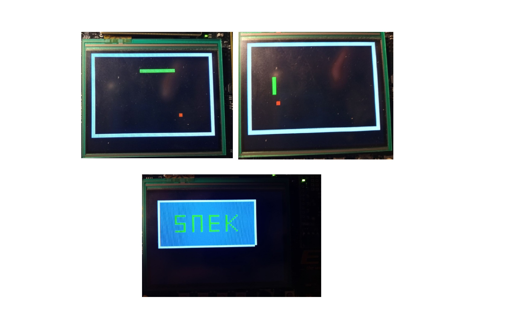

# Low-Level Programming
This is the term project for TDT4258 - Low-Level Programming at NTNU Trondheim, fall 2019. The practical goal of the lab exercises was to implement a small game for the EFM32 development board. This development board has a microcontroller, a display and sound. In addition, there's given a small prototype gamepad with buttons and LEDs. Together, this system provides all the hardware components which are needed for making a computer game. The task was to program the microcontroller to control all I/O–components needed for the game and use these in a computer game we implemented ourselves. We chose to implement "snake" as our game.

 

## Part 1. ARM Assembler
In exercise 1, you will familiarise yourself with some of the widely used development
tools from GNU. These will be used for programming in assembly code for ARM.
You will learn how to write the startup code for ARM processors. In this exercise you
will control everything yourself, from the very first instruction executed by the processor.
You will learn how to program GPIO. This will be used to detect which buttons are
pressed on the gamepad and to turn on or off LEDs. In addition, you will learn how to
handle interrupts in assembly. 

## Part 2. Embedded C 
In exercise 2, you will continue to use the GNU toolchain, but this time you will program in C.
You will have no operating system available. This means that you have to do most of the
job yourselves, as you did in exercise 1, but in the much more comfortable C language.
You will also have the most basic startup code and C libraries available.
Here you will again program for the gamepad. In addition, you will program the sound
effects which will be used in the computer game. You will have to write code that
generates sounds and program the DAC, a hardware component which converts digital
data to analog signals. The analog signals generated by the DAC are further sent to an
amplifier and to a speaker (headphones).

## Part 3. uClinux
This is the last exercise in the course, which will result in a small game running on
the development board. This time, you will install an embedded variant of the Linux
operating system on the board and make your game as a Linux application.
The gamepad is necessary for controlling the game, so a Linux device driver must be
implemented that communicates with the buttons and which is used by the game application. The game output will use the TFT display on the board, programmed through the Linux framebuffer device.

## Finished Game
 

## Folder structure
The folder structure of this project was set up for easy development and maintenance. This section will explain briefly the folder structure of the project.
  
  #### inc
  The include folder holds the header and definition files. For the assembler part of the project this is a .s file with register definitions and for the Embedded-C part of the project it holds the header files.
  
  #### src
  All the .c files corresponding to the .h files in "inc" can be found in this folder. These files are the definitions of all the functions declared in the .h files. The assembler part had such few files that it did not need this folder.
  #### build
  The build folder contains all the object, elf and binary files. This is so it doesn't clutter the space during development, as these files are only used during compilation or uploading of the code. Keeping them in seperate folder makes the project cleaner and easier to maintain.
  #### lib
  This folder holds the linkerscript. The linkerscript links all the files together.
  
  #### vscode
It was set up a workspace in VScode for easy development. This is a template that opens all the folders and gives easy access to all the files. The user configured settings like the formatter used, can also be saved in workspaces. If there is a vscode folder, it contains the workspace-template. For the assembler part this was not used, as it was coded directly in linux and Gedit.

## Tools
TODO
