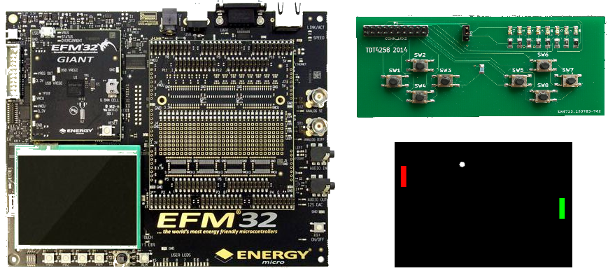

# Low-Level Programming
This is the term project for TDT4258 - Low-Level Programming at NTNU Trondheim, fall 2019. The practical goal of the lab exercises was to implement a small game for the EFM32 development board. This development board has a microcontroller, a display and sound. In addition, there's given a small prototype gamepad with buttons and LEDs. Together, this system provides all the hardware components which are needed for making a computer game. The task was to program the microcontroller to control all I/O–components needed for the game and use these in a computer game we implemented ourselves.

 

## 1. ARM Assembler
The first part of the project was programming of buttons, LEDs, interrupts and low energy settings in assembler language. 

## 2. Embedded C 
The second part was bare metal C programming on the same board with more extensive functionality.

## 3. uClinux
The third part was programming with an operatingsystem uClinux and implementing the game.

## Folder structure
The folder structure of this project was set up for easy development and maintenance. This section will explain briefly the folder structure of the project.
  
  #### inc
  The include folder holds the header and definition files. For the assembler part of the project this is a .s file with register definitions and for the Embedded-C part of the project it holds the header files.
  
  #### src
  All the .c files corresponding to the .h files in "inc" can be found in this folder. These files are the definitions of all the functions declared in the .h files. The assembler part had such few files that it did not need this folder.
  #### build
  The build folder contains all the object, elf and binary files. This is so it doesn't clutter the space during development, as these files are only used during compilation or uploading of the code. Keeping them in seperate folder makes the project cleaner and easier to maintain.
  #### lib
  This folder holds the linkerscript. The linkerscript links all the files together.
  
  #### vscode
It was set up a workspace in VScode for easy development. This is a template that opens all the folders and gives easy access to all the files. The user configured settings like the formatter used, can also be saved in workspaces. If there is a vscode folder, it contains the workspace-template. For the assembler part this was not used, as it was coded directly in linux and Gedit.

## Tools
TODO
